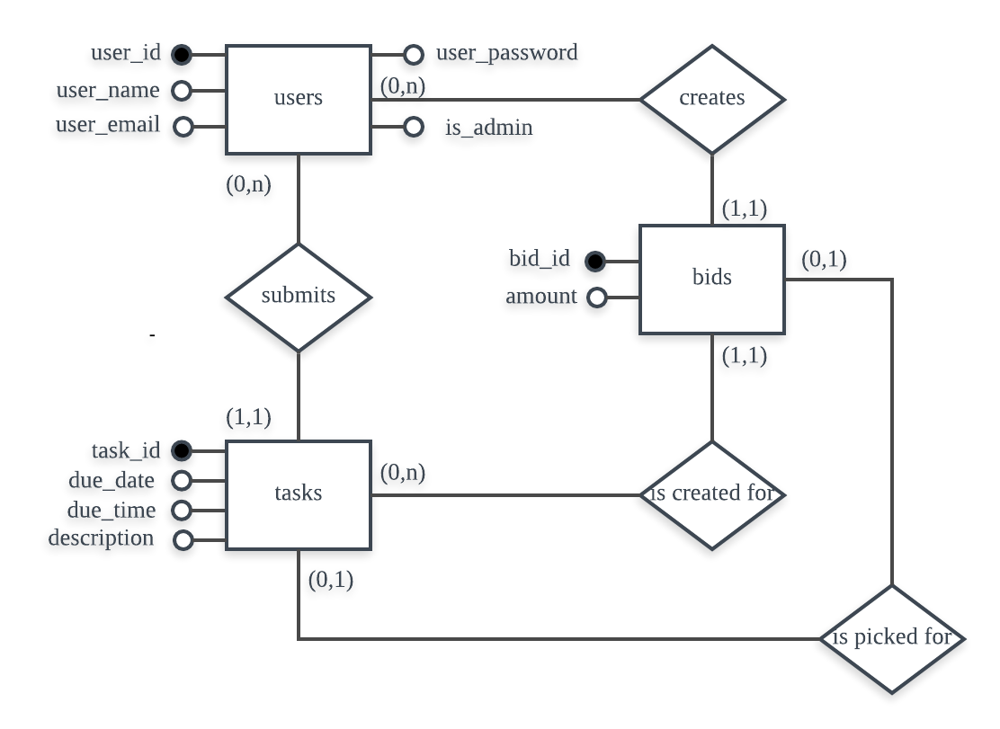

## Design Report(team 37)

* Entity Relationship Diagram


* SQL DDL Code
```sql
CREATE TABLE users (
user_id SERIAL PRIMARY KEY,
user_name VARCHAR(64) NOT NULL,
user_password VARCHAR(64) NOT NULL,
user_email VARCHAR(64) NOT NULL,
is_admin BOOLEAN NOT NULL DEFAULT FALSE,
CHECK (user_email LIKE "%@%.%"),
CHECK (user_name NOT LIKE "%[^A-Z0-9*]%" AND LEN(user_name)>=5),
CHECK (user_password LIKE "%[0-9]%" AND user_password LIKE "%[A-Z]%" 
	AND user_password LIKE "%[!@#$%a^&*()-_+=.,;:`~]%" AND LEN(user_password)>=8);

CREATE TABLE tasks (
task_id SERIAL PRIMARY KEY,
owner_id INTEGER NOT NULL,
due_date DATE NOT NULL,
due_time TIME NOT NULL,
description VARCHAR(256) NOT NULL,
FOREIGN KEY owner_id REFERENCES users(user_id) ON DELETE CASCADE),
CHECK (due_date >= GetDate());


CREATE TABLE bids (
bid_id SERIAL PRIMARY KEY,
bidder_id INTEGER NOT NULL,
task_id INTEGER NOT NULL,
amount INTEGER NOT NULL,
FOREIGN KEY bidder_id REFERENCES users(user_id) ON DELETE CASCADE,
FOREIGN KEY task_id REFERENCES task(task_id) ON DELETE CASCADE)
CHECK (amount < 100000);

CREATE TABLE is_picked_for (
task_id INTEGER PRIMARY KEY,
bid_id INTEGER NOT NULL,
FOREIGN KEY task_id REFERENCES task(task_id) ON DELETE CASCADE,
FOREIGN KEY bid_id REFERENCES bid(bid_id) ON DELETE CASCADE);
```
